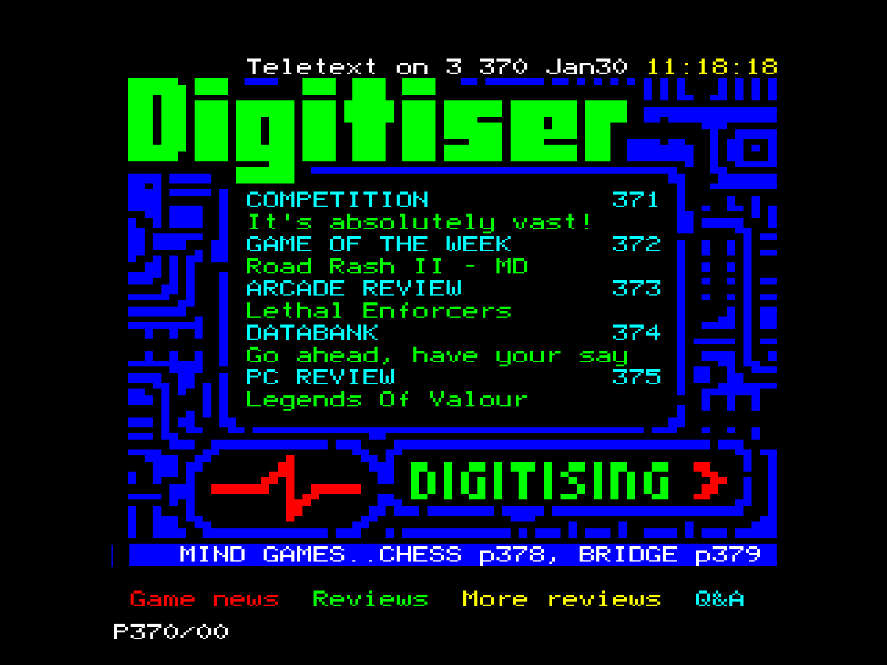
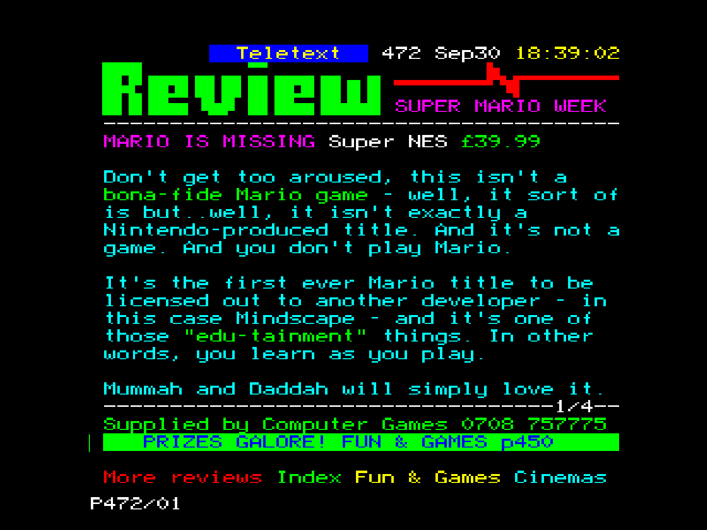

# Teletext for MiSTer FPGA

Browse restored pages from the history of UK Teletext on MiSTer FPGA. This core opens individual T42 pages and small dated TTS snapshots, with keyboard and controller navigation, Fastext links and Reveal.

This release is an archive viewer: it does not receive a live television broadcast.

## Install

1. In the **Releases** tab, download **Teletext_20260925.rbf**. The matching **Teletext_20260925-source.zip** is available beside it.
2. Copy the RBF to the **_Utility** folder on your MiSTer SD card.
3. Create a folder named **Teletext** at the root of the SD card. Download a restored T42 page from the [Teletext Restoration archive](https://github.com/teletext-restoration/teletext-restoration), or use the converter in the source ZIP to build a dated TTS capture from T42 pages you have downloaded. Put your T42 or TTS files in **Teletext**.
4. Launch the Teletext core from MiSTer. Open its menu and choose **Load dated snapshot** for a TTS file or **Load one Teletext page** for a T42 file. Close the menu to view the page.

## Navigate

| Action | Keyboard | Controller |
| --- | --- | --- |
| Enter a page number | Type three digits, such as 470 | Use Up/Down through pages included in the snapshot |
| Correct a partly typed number | Backspace or Delete | — |
| Previous/next available main page | Down/Up | D-pad Down/Up |
| Previous/next subpage | Left/Right outside Fastext mode | D-pad Left/Right outside Fastext mode; L/R shoulders work in either mode |
| Enter or leave Fastext mode | F | B toggles; A enters mode when inactive |
| Highlight a Fastext link | Left/Right in Fastext mode | D-pad Left/Right in Fastext mode |
| Follow the highlighted link | Enter/Return | A in Fastext mode |
| Follow a link by colour | R, G, Y or B | Highlight it and press A |
| Reveal or hide concealed text | V | X |

The selected Fastext label has a coloured underline. If a page number or link is absent from the loaded snapshot, **NO PAGE** appears and the current page stays visible. A T42 file displays one page; load a TTS file to navigate among multiple pages.

On MiSTer, map the controller under **Define Teletext buttons** if its buttons do not match the table. The core's button order is Fastext select, Fastext mode, Subpage left, Subpage right, Reveal. MiSTer's defaults map these to A, B, L, R, X. Map D-pad directions in the same menu. Your controller must first be recognised by MiSTer's system-wide **Define joystick buttons** setup.

## Screenshots

## What is Teletext?

Teletext was a text and graphics information service carried in television broadcasts. Viewers could enter a three-digit page number to browse news, sport, listings and games on a compatible TV. Later services added four coloured Fastext buttons to jump to suggested pages. Some pages concealed answers or jokes until the viewer pressed Reveal.

Many surviving UK pages have been recovered from old VHS home recordings. Although the recordings captured ordinary TV programmes, they also preserved some Teletext data sent alongside the picture. Volunteers extracted and restored that data. A tape captures only the pages transmitted while it was recording, sometimes with missing or corrupted data. Each recovered date is therefore a **partial snapshot of that service at that time**, rather than a complete historical edition or a live feed.

## Download restored Teletext files

- **[Teletext Restoration archive](https://github.com/teletext-restoration/teletext-restoration)** — restored UK pages organised by year, date and channel.
- **[Teletext Archaeologist](https://teletextarchaeologist.org/the-archive/)** links to a browsable online archive for exploring pages before downloading restored files.

## Scope and credits

This viewer handles ordinary text, coloured graphics, Fastext links when their targets are in the current TTS snapshot, concealed text, double-height text, flash and several background/graphics controls.

This release includes the compiled core and **its corresponding source as a separate download** on the same GitHub release. See [LICENSE](LICENSE) and [CREDITS.md](CREDITS.md) for upstream attribution, component notices and licensing details. Teletext page content belongs to its respective rights holders and is not covered by the core's source licence.

## AI assistance

This core and its documentation were developed with substantial assistance from OpenAI's Codex/ChatGPT, including source generation, debugging and drafting. A human maintainer directed the work, compiled the FPGA core and tested it on hardware. AI-generated contributions can contain mistakes; please report any problems through this repository's issues.
